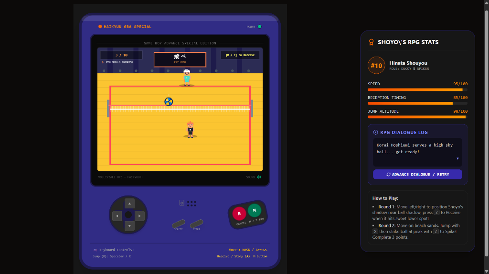
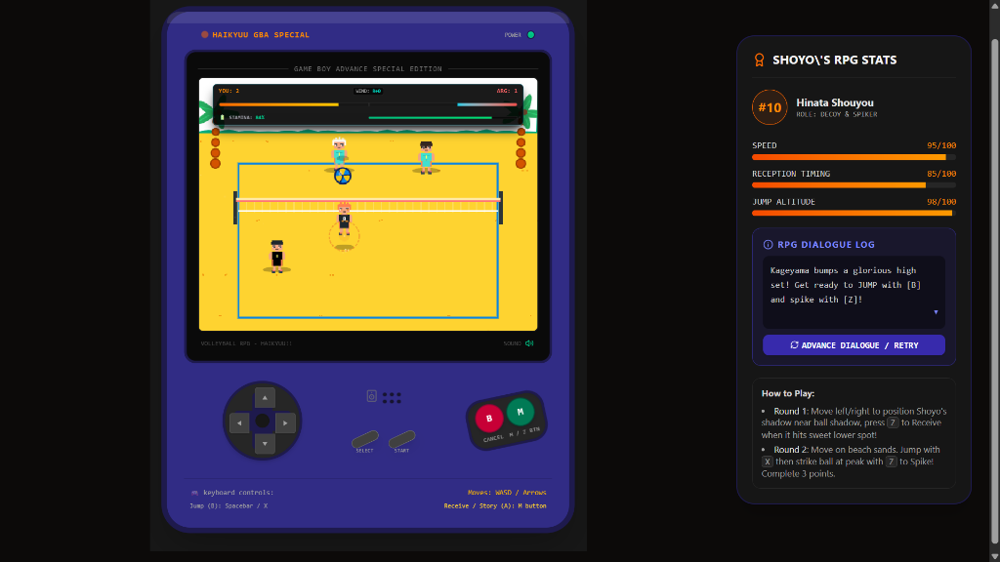

# Haikyuu Volleyball Retro RPG 🏐

A browser-based retro volleyball game inspired by Game Boy Advance aesthetics, built with React, TypeScript, and HTML5 Canvas.

## 📸 Gameplay Preview

| Gym Training & Drills | Beach Match & Spiking |
| :---: | :---: |
|  |  |

---

## 🛠️ Technologies Used

- **Framework**: React 19, TypeScript, Vite
- **Graphics & Rendering**: HTML5 Canvas API (2D game loop, ball trajectory, player sprites)
- **Audio Engine**: Web Audio API (procedural 8-bit sound synthesis)
- **Styling & UI**: Tailwind CSS, Custom GBA Console Bezel Layout

---

## ✨ Key Features

- **Gym Training & Drills**: Practice positioning and reception timing on the indoor court.
- **Volleyball Physics, Timing & Wind Mechanics**: Real-time ball arc physics, jump apex timing, and dynamic wind resistance affecting ball drift.
- **RPG Stats & Dialogue System**: Live player stats (Speed, Reception Timing, Jump Altitude) and interactive match dialogue for Hinata Shoyo.
- **Procedural 8-Bit Audio**: Sound effects generated dynamically via Web Audio API without external audio files.
- **Hybrid Controls**: Support for both keyboard controls (WASD/Arrows, Spacebar, Z/X) and on-screen clickable GBA buttons.

---

## 🧠 The Process & Architecture

1. **GBA Shell**: Built a modular React container (GBAFrame.tsx) replicating retro handheld consoles.
2. **Canvas Game Loop**: Integrated an optimized 
equestAnimationFrame loop in VolleyballRenderer.ts, decoupling canvas rendering from React state.
3. **Procedural Synthesizer**: Built AudioEngine.ts using oscillator nodes and gain envelopes for retro sound effects.
4. **State Machine**: Structured volleyball phase transitions (Serve -> Receive -> Set -> Spike -> Score) using strict TypeScript interfaces.

---

## 📚 What I Learned

- Managing high-frequency 2D Canvas rendering cycles in React without performance bottlenecks.
- Simulating dynamic wind vectors and trajectory curves in a 2D game loop.
- Procedural sound generation using native Web Audio oscillators.
- Designing responsive, retro handheld user interfaces.

---

## 🚀 How It Can Be Improved

- [ ] **Bug Hunting & Feedback**: There are some edge-case physics bugs that I as a developer am still trying to figure out so please play the game and let me know what you encounter.
- [ ] **Multiplayer Support**: Add 2-player local or online matches using WebSockets.
- [ ] **Roster & Special Moves**: Expand character selection (Kageyama, Tsukishima, Bokuto) with signature abilities.
- [ ] **Persistent Backend**: Connect a database to store high scores and player progress.

---

## 💻 Running the Project Locally

``bash
# 1. Clone repository
git clone https://github.com/kritanshSharma/RPG-Game.git

# 2. Enter directory
cd RPG-Game/Haikyuu

# 3. Install packages
npm install

# 4. Start dev server
node .\node_modules\vite\bin\vite.js --port=3000
``

Open your browser and navigate to http://localhost:3000.
